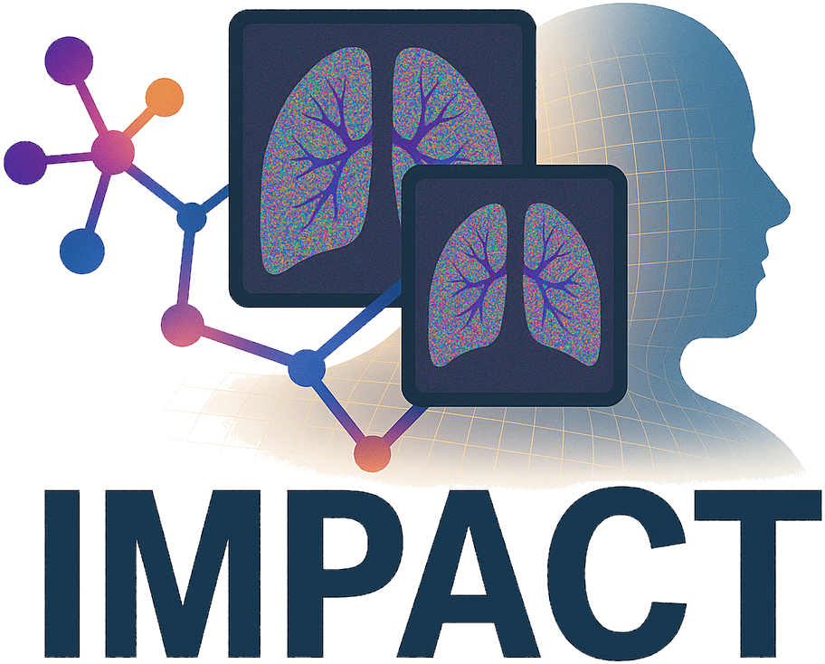

# 🔬 IMPACT Reg: A Generic Semantic Loss for Multimodal Image Registration

[](https://github.com/SuperElastix/elastix/raw/main/LICENSE)
[](https://huggingface.co/VBoussot/impact-torchscript-models)
[](https://hub.docker.com/repository/docker/vboussot/elastix_impact)
 [](https://arxiv.org/abs/2503.24121)



**IMPACT Reg** is a novel, task-agnostic similarity metric designed for **multimodal medical image registration**. Instead of relying on intensity based metric, handcrafted descriptors or training task-specific models, IMPACT reuses powerful segmentation foundation models (e.g., TotalSegmentator, SAM) as generic feature extractors. These deep features are used to define a semantic similarity loss, optimized directly in registration frameworks like Elastix or VoxelMorph.

<br>

📚 Reference

> 🔗 IMPACT : A Generic Semantic Loss for Multimodal Image Registration 
> Valentin Boussot, Cédric Hémon, Jean-Claude Nunes, Jason Dowling, Simon Rouzé, Caroline Lafond, Anaïs Barateau, Jean-Louis Dillenseger
> [arXiv:2503.24121](https://arxiv.org/abs/2503.24121) – _Under review_ 

---

## ✨ Key Features

- **Generic, Training-free**  
  No need for task-specific training, IMPACT reuses powerful representations from large-scale pretrained segmentation models.

- **Flexible model integration**  
  Compatible with TorchScript 2D/3D models (e.g., TotalSegmentator, SAM2.1, MIND), supporting multi-layer and multi-model fusion, multi-resolution setups, and fully open to experimentation with custom architectures and configurations.

- **Jacobian vs Static optimization modes**  
  Choose between fully differentiable Jacobian mode (for downsampling models) and fast inference-only Static mode, depending on model type and computation time constraints.

- **Robust across modalities**  
  Handles complex multimodal scenarios (CT/CBCT, MR/CT) using a unified semantic loss robust to intensity variations.

- **Benchmark-proven**
  Ranked in the top participants of multiple Learn2Reg challenges, showing state-of-the-art performance across diverse tasks (thorax, abdomen, pelvis, CT/CBCT/MRI).

- **Seamless integration with Elastix**  
  Natively implemented as a standard Elastix metric, IMPACT inherits all the strengths of classical registration: multi-resolution strategies, mask support, sparce deformation models, and full reproducibility. It also handles images of different sizes, resolutions, and fields of view, making it ideal for real-world clinical datasets with heterogeneous inputs.

- **Efficient runtime for standard registration tasks**  
  - ~150 seconds (Static mode)  
  - ~300 seconds (Jacobian mode)

- **Docker-ready for quick deployment**  
  Run out of the box with a single Docker command, no need to install dependencies manually.

---

## 🏆 Challenge Results

IMPACT has demonstrated strong generalization performance across multiple tasks without training.
🔗 [Learn2Reg Challenge](https://learn2reg.grand-challenge.org/)

| Challenge       | Task                           | Rank      
|----------------|--------------------------------|-----------
| **Learn2Reg 2021** | CT Lung Registration            | 🥉 3rd     
| **Learn2Reg 2023** | Thorax CBCT                    | 🥉 Top-6
| **Learn2Reg 2023** | Abdomen MR→CT  | 🥈 2nd 

---

## 🔬 Modular and Extensible Design

Beyond its performance, IMPACT is designed as a modular platform that facilitates systematic experimentation with pretrained models, feature layers, and distance functions. This flexibility enables researchers to explore various feature extraction methods, fostering innovation and adaptability in multimodal image registration tasks.

--- 

## 🧭 Model Selection and Recommendations

Model performance depends on both the **feature extraction strategy** and the **choice of extractor models**.  
The following configurations were found to be optimal in the IMPACT study:

| 🧪 Scenario | 🔧 Optimal Configuration | 💡 Rationale |
|-------------|--------------------------|--------------|
| **CT/CBCT** | **Early feature layers (2-Layers) + Jacobian mode** | Early layers of segmentation networks tend to **denoise** and **enhance anatomical structures** across modalities, improving **geometric alignment** and **robustness to artifacts**. |
| **MR/CT** | **High-level feature layer (7-Layers) + Static mode + MIND** | Registration behaves more like **contour-based, segmentation-driven alignment**; **MIND** complements it by capturing **intra-organ**, leading to better anatomical consistency. |

---

### 📊 Model Insights

| Model | Type | Typical Use | Comment |
|--------|------|--------------|----------|
| **TS/M730** | MR and CT (3D) | 🔹 **Default baseline** | Most stable and general-purpose model |
| **SAM2.1** | Foundation (2D) | ⚡ Fast evaluation | Good generalization; suitable for quick or exploratory 2D experiments. |
| **M258** | CT (3D, Lung vessels) | 🎯 Organ-specific | Models trained on the **target anatomical structure** (e.g., lung or vessels) provide **better local alignment** in the corresponding regions. |
| **MIND** | Handcrafted descriptor | 🧩 Cross-modality | Complements contour-based methods by **recovering intra-organ information**, enhancing MR/CT alignment. |

---

### ✅ Summary

> • **CT/CBCT → Early layers + Jacobian** — enhance structure visibility while reducing noise and artifacts.
> • **MR/CT → High-level layers + Static + MIND** — emphasize anatomical contours and intra-organ consistency.  
> • Use **`TS/M730_2_Layers`** as the **default model**, and **organ-specific models** (e.g., `M258`) for targeted anatomical regions.

---

## 🚀 Quick Start with Docker

You can quickly test the IMPACT metric using the provided Docker environment:

```bash
git clone https://github.com/vboussot/ImpactLoss.git
cd ImpactLoss
```

Build the Docker image
```bash
docker build -t elastix_impact Docker
```

Then, run Elastix with your own data:

```bash
docker run --rm --gpus all \
  -v "./Data:/Data" \
  -v "./Out:/Out" \
  elastix_impact
```

Make sure that the `Data/` folder contains:
- `FixedImage.mha`, `MovingImage.mha` your input images to be registered. These files can be provided in either .mha or .nii.gz format.
- `ParameterMap.txt` using Impact configuration. 👉 See [`ParameterMaps/README.md`](ParameterMaps/README.md) for detailed configuration examples.
- A `Data/Models/` directory with TorchScript models. 👉 See [`Data/Models/README.md`](Data/Models/README.md) for model download instructions.

See [`Docker/README.md`](Docker/README.md) for full details and usage examples.

💡 You can also directly pull the prebuilt image from Docker Hub:
```bash
docker pull vboussot/elastix_impact
```

👉 [](https://hub.docker.com/repository/docker/vboussot/elastix_impact)

---

## 🛠️ Manual Build Instructions (without Docker)

Build Elastix with IMPACT support directly on your machine.

### 📦 (Optional) Get LibTorch (if not already installed)

Download and extract the **C++ distribution** of LibTorch (with or without CUDA) from the official website:

🔗 https://pytorch.org/

### 📦 (Optional) Build ITK (if not already installed):

```bash
git clone https://github.com/InsightSoftwareConsortium/ITK.git
mkdir ITK-build ITK-install
cd ITK-build
cmake -DCMAKE_INSTALL_PREFIX=../ITK-install ../ITK
make install
cd ..
```

### 🧱 Build Instructions

1. Clone the [ImpactElastix](https://github.com/vboussot/ImpactElastix) repository:

```bash
git clone https://github.com/vboussot/ImpactElastix.git
```

2. Create build and install directories:

```bash
mkdir ImpactElastix-build ImpactElastix-install
cd ImpactElastix-build
```

3. Configure the build with CMake:

```bash
cmake -DTorch_DIR=../libtorch/share/cmake/Torch/ \
      -DITK_DIR=../ITK-install/lib/cmake/ITK-6.0/ \
      -DCMAKE_INSTALL_PREFIX=../ImpactElastix-install \
      ../ImpactElastix
```

- `Torch_DIR`: path to the **CMake config directory of LibTorch** (usually inside `libtorch/share/cmake/Torch/`)
- `ITK_DIR`: path to the **CMake config directory of ITK**, typically inside your ITK install folder (e.g., `ITK-install/lib/cmake/ITK-*`)

4. Build and install Elastix with IMPACT:

```bash
make install
```
The final binaries will be located in:

```
../ImpactElastix-install/bin/elastix
```

Before running `elastix`, make sure the required shared libraries are accessible at runtime by setting the `LD_LIBRARY_PATH`:

```bash
export LD_LIBRARY_PATH=lib/libtorch/lib:$LD_LIBRARY_PATH
export LD_LIBRARY_PATH=ImpactElastix-install/lib:$LD_LIBRARY_PATH
```

You can then run:

```bash
../ImpactElastix-install/bin/elastix
```

## ⚙️ Run Elastix

To use IMPACT, start by downloading the pretrained TorchScript models.  
👉 See [`Data/Models/README.md`](Data/Models/README.md) for download instructions.

Elastix is executed as usual, using a parameter map configured to use the IMPACT metric.  
👉 Refer to [`ParameterMaps/README.md`](ParameterMaps/README.md) for detailed configuration examples.

⚠️ **Preprocessing Recommendation**  
Input images must be **preprocessed consistently with the training of the selected model**.  
For TotalSegmentator-based models, images should be in **canonical orientation**.

Apply the appropriate preprocessing depending on the model:

- **ImageNet-based models** (e.g., SAM2.1, DINOv2):  
  - Normalize intensities to [0, 1]  
  - Then standardize with mean `0.485` and standard deviation `0.229` 

- **MRI models** (e.g., TS/M730–M733):  
  - Standardize intensities to zero mean and unit variance  

- **CT models** (e.g., all other TotalSegmentator variants, MIND):  
  - Clip intensities to `[-1024, 276]` HU  
  - Then normalize by centering at `-370 HU` and scaling by `436.6`

Complete example of how to run registration with IMPACT is provided in:  
👉 [`run_impact_example.py`](run_impact_example.py)

## 🧠 Using IMPACT in PyTorch

You can also use **IMPACT** directly as a PyTorch loss module.  
The implementation is available in [`IMPACT.py`](IMPACT.py).

```python
from IMPACT import IMPACT
import torch

# Instantiate the IMPACT loss
loss_fn = IMPACT(
    model_name="TS/M730_2_Layers",  # TorchScript model on Hugging Face
    shape=[0, 0, 0],                # [H, W, D] for explicit size, or [0, 0, 0] to disable resampling
    in_channels=1,                  # Number of input channels
    weights=[1, 1]                  # One weight per output layer
)

# Example 3D tensors
A = torch.rand(1, 1, 128, 128, 128)
B = torch.rand(1, 1, 128, 128, 128)

# Compute similarity loss
loss = loss_fn(A, B)
print(loss)
```

### 📦 Features

Automatically downloads TorchScript models from Hugging Face

The available model names **follow the same folder hierarchy** as in the [Hugging Face repository](https://huggingface.co/VBoussot/impact-torchscript-models), e.g.:

- `TS/M730_2_Layers`  
- `SAM2.1/Tiny_2_Layers`  
- `MIND/R2D2.pt`  

📁 Cached under `~/.IMPACT/models/`  
⚙️ Handles resizing and channel replication  
🧮 Computes a **weighted L1 semantic loss** between deep feature maps
